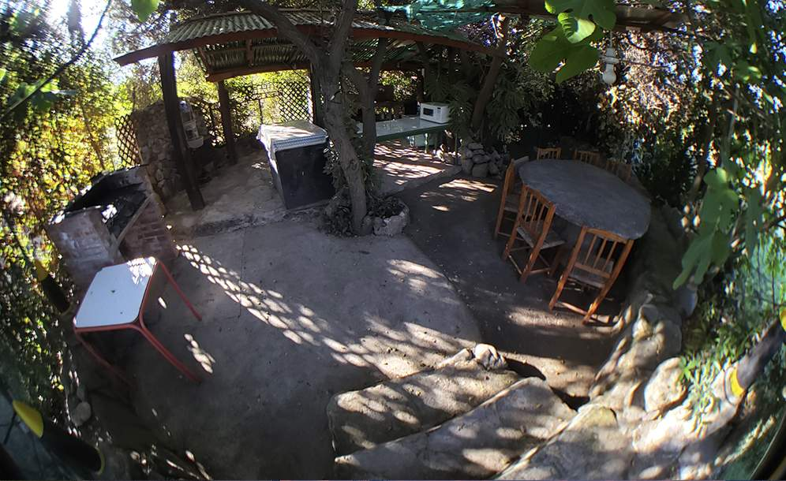
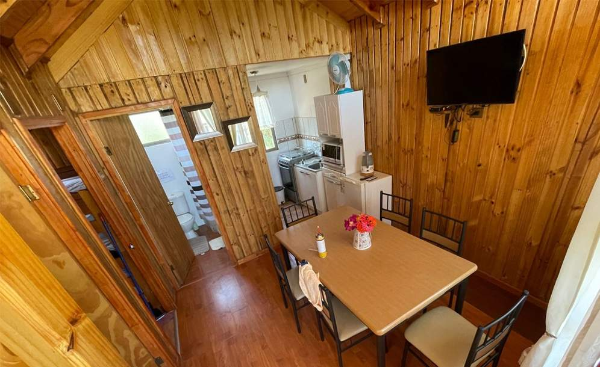
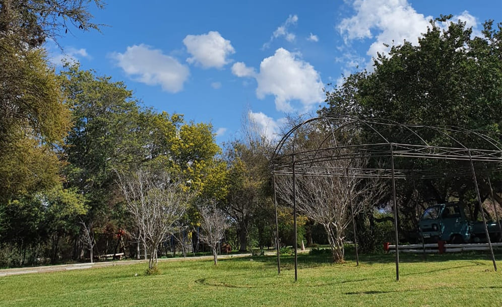
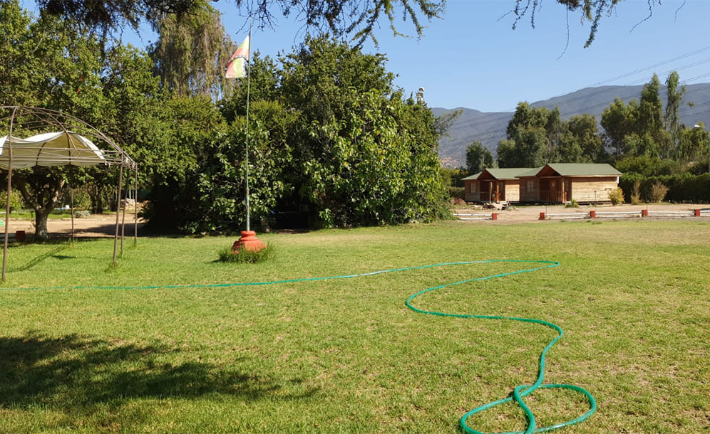

#  TERCERA ENTREGA DEL PROYECTO FINAL

---
Link web: https://wilsondelcanto.dev/tercera_entrega

---

## Estructura de la web


## - Keywords, descripciones y títulos


__index.html__ //
> Pagina main del sitio web, donde tenemos: 
> - Nav
> - Banner
> - Quienes somos?
> - Galeria de imagenes
> - Ubicacion
> - Footer

* Keywords (cabanas, olmue, quinta region, valparaiso, entretencion, piscina, quincho, cabañas)
* Descripción (Arriendo de cabañas en la comuna de Olmué, Quinta region de Chile)
* Titulo de la web (Cabañas Olmué - Home)


__eventos.html__ //
> Pagina eventos del sitio web, donde tenemos: 
> - Nav
> - Tipos de eventos
> - Footer

* Keywords (cabanas, olmue, quinta region, valparaiso, entretencion, piscina, quincho, cabañas)
* Descripción (Contamos con varios eventos para que nuestros clientes puedan elegir)
* Se cambia titulo de la web (Cabañas Olmué - eventos)

__cabanas.html__ //
> Pagina cabañas del sitio web, donde tenemos: 
> - Nav
> - Caracteristicas de las cabañas
> - Footer


* Keywords (cabanas, olmue, quinta region, valparaiso, entretencion, piscina, quincho, cabañas)
* Descripción (Fotos de nuestras cabañas, y breve descripción)
* Titulo de la web (Cabañas Olmué - cabanas)


__entretencion.html__ //

* Keywords (cabanas, olmue, quinta region, valparaiso entretencion, piscina, quincho, cabañas)
* Descripción (Variedad de Entretención dentro de nuestro recinto)
* Titulo de la web (Cabañas Olmué - entretencion)
> Pagina entretencion del sitio web, donde tenemos: 
> - Nav
> - Tipos de entretenciones
> - Footer


__registrate.html__ //

* Keywords (cabanas, olmue, quinta region, valparaiso, entretencion, piscina, quincho, cabañas)
* Descripción (registro de cuentas nuevas)
* Titulo de la web (Cabañas Olmué - registrate)
> Pagina regístrate del sitio web, donde tenemos: 
> - Nav
> - Folio de registro de cuentas
> - Footer

// _Se agrega iconfav.ico en todas las paginas_

***
## - Sass

Se subdividió en dos partes
1. Boostrap (Archivos sin compilar llamados desde boostrap.scss)
2. Proyecto (Módulos del sitio web llamados desde compilado.scss)

Ambos son llamados para ser compilados desde main.scss
## 1.- Uso de variables definidas 

### Se definieron las variables dentro de sass en sass/proyecto/__variables.scss

``` 
$hoverColor: #ffffff;
$textcarta: #ffffff;
$carta1: #39816bce;
$carta2: #809411cb;
$border: 0.1rem solid;
$borderRadius: 1rem;
$shadow: 0.4rem 0.4rem 1rem #000000;
$bordercuadrado: solid 2px #667080;
```


***
## 2.- Uso de mixins

### Se definieron los mixins dentro de sass en sass/proyecto/__mixins.scss

``` 
@mixin imagenesSizes($width, $height) {
    width: $width;
    height: $height;
    border-radius: $borderRadius;
}

@mixin name {
    
}
```
### Los cuales fueron incluidos dentro de sass en sass/proyecto/__cabanas.scss

```
@media screen and (min-width: 480px) {
#cabanas {
    .container {
    line-height: 2rem;
    align-items: center;
    text-align: center;
    }
    img {
    @include imagenesSizes(18rem,16rem);
    }
    h2 {
    padding: 2rem;
    }
}
}
```
***
## 3.- Uso de maps
### Se definió el uso de los maps dentro de sass en sass/proyecto/__entertaiments.scss

```
/* maps con variable desde variables.scss */
        $cartas:(
          carta1: $carta1,
          carta2: $carta2
        );

        @each $var, $color in $cartas {
          .car-#{$var}{
              background-color: $color;
              border-radius: $borderRadius;
              padding: 0.2rem;
              text-align: center;
              margin: 1rem 0rem; 
              border: $border;
              box-shadow: $shadow;
          }
```
***

## 4.- Uso de extend
### Se definió el uso de exntend dentro de sass en sass/proyecto/__floatButton.scss

```
  .boton {
  position: fixed;
  display: inline;
  z-index: 99;
  transition: all 300ms ease 0ms;
      &:hover {
          transform: translateY(-7px);
          color: rgb(255, 255, 255);
          
        }
  text-decoration: none;
  
  }

  .wsp-flotante {
    @extend .boton;
    padding: 0.8rem 1.2rem;
    bottom: 10px;
    left: 40px;
        img {
        width: 10rem;
      }
    animation: wsp-flotante 1s ease-in-out 0s 1 normal;
}
```

***

## Animaciones y transiciones

## 1.- Animaciones
### Se usaron animaciones en el index mayormente. Ademas en los botones flotantes y en el fondo del navigation /sass/proyecto/__floatButton.scss

```
  .wsp-flotante {
    @extend .boton;
    padding: 0.8rem 1.2rem;
    bottom: 10px;
    left: 40px;
        img {
        width: 10rem;
      }
    animation: wsp-flotante 1s ease-in-out 0s 1 normal;
}
    @keyframes wsp-flotante {
    0% {
      opacity: 0;
      transform: translateY(-50px);
    }

    100% {
      opacity: 1;
      transform: translateY(0);
    }
  }
```

***
## 2.- Transiciones
### Se usaron transiciones de hover en los botones y en el logotipo principal del nav, entre otras cosas. sass/proyecto/__floatButton.scss


```
  .boton {
  position: fixed;
  display: inline;
  z-index: 99;
  transition: all 300ms ease 0ms;
      &:hover {
          transform: translateY(-7px);
          color: rgb(255, 255, 255);
          
        }
  text-decoration: none;
  
  }
```

```
  .logo {
    transition: transform 300ms ease-in-out;
    font-size: 1.2rem;
        &:hover {
    transform: translate(0px, 0px) scale(1.1, 1.1);
        }
    }
```

***
## - Boostrap

## 1.- Grilla
### Se utilizo la grilla de bootstrap para realidad el footer. /index.html
```
<footer>
        <div class="container">
            <div class="row justify-content-center">

                <!-- Menu general web -->
                <div class="col-sm-4 col-md-3 item">
                    <h3>Servicios</h3>
                    <ul>
                        <li><a href="./pages/eventos.html">Eventos</a></li>
                        <li><a href="./pages/cabanas.html">Cabañas</a></li>
                        <li><a href="./pages/entretenciones.html">Entretención</a></li>
                    </ul>
                </div>

                <!-- Menu interno de index  -->
                <div class="col-sm-4 col-md-3 item">
                    <h3>Quien somos?</h3>
                    <ul>
                        <li><a href="#quienes-somos">Nosotros</a></li>
                        <li><a href="#galeria">Galería</a></li>
                        <li><a href="#location">Contacto</a></li>
                    </ul>
                </div>

                <!-- suscripción a noticias -->
                <div class="col-sm-4 col-md-3 item barra">
                    <h3>Recibe nuestras ofertas!</h3>
                    <form>
                        <ul>
                            <li>
                                <input class="barra-subscriptions" type="email"
                                    placeholder="Dirección de correo electrónico">
                            </li>
                            <li>
                                <button>SUSCRÍBETE</button>
                            </li>
                        </ul>
                    </form>
                </div>

                <!-- Redes sociales -->
                <div class="col-lg-3 item social">
                    <a href="https://facebook.com/" target="_blank"><i class="fa-brands fa-facebook"></i></a>
                    <a href="https://twitter.com/" target="_blank"><i class="fa-brands fa-twitter"></i></a>
                    <a href="https://www.instagram.com/" target="_blank"><i class="fa-brands fa-instagram"></i></a>
                    <a href="https://wa.me/56954205188" target="_blank"> <i class="fa-brands fa-whatsapp"></i></a>
                    <a href="mailto:wilsondelcanto.redes@gmail.com"><i class="fa-solid fa-envelope"></i></a>

                    <!-- Derechos de autor -->
                    <p class="copyright"><a href="#">Cabañas Olmué &copy;, Chile. 2022</a></p>
                </div>
            </div>
        </div>
    </footer>
```

## 2.- Componentes
### Se utilizo el nav y el carrousel como componentes.

### Nav.- /index.html
```
        <nav class="navbar navbar-expand-lg navbar-dark nav-fondo">
            <div class="container-fluid">
                <a class="navbar-brand logo" href="./index.html">Cabañas <span class="logo-span">Olmué</span></a>

                <button class="navbar-toggler btn-outline-success" type="button" data-bs-toggle="collapse"
                    data-bs-target="#navbarScroll" aria-controls="navbarScroll" aria-expanded="false"
                    aria-label="Toggle navigation">

                    <span class="navbar-toggler-icon"></span>

                </button>
                <div class="collapse navbar-collapse" id="navbarScroll">

                    <ul class="navbar-nav me-auto my-2 my-lg-0 navbar-nav-scroll " style="--bs-scroll-height: 100px;">
                        <li class="nav-item">
                            <a class="nav-link active" aria-current="page" href="./index.html">Inicio</a>
                        </li>

                        <li class="nav-item">
                            <a class="nav-link" href="#quienes-somos">Quienes somos?</a>
                        </li>

                        <li class="nav-item">
                            <a class="nav-link" href="#galeria">Galería</a>
                        </li>

                        <li class="nav-item">
                            <a class="nav-link" href="#location">Ubicación</a>
                        </li>
                        <li class="nav-item">
                            <a class="nav-link" href="./pages/eventos.html">Eventos</a>
                        </li>
                        <li class="nav-item">
                            <a class="nav-link" href="./pages/cabanas.html">Cabañas</a>
                        </li>
                        <li class="nav-item">
                            <a class="nav-link" href="./pages/entretenciones.html">Entretención</a>
                        </li>
                    </ul>

                    <form class="d-flex" action="./pages/registrate.html">
                        <button class=" btn-outline-success me-2" type="submit">Mi Cuenta </button>
                    </form>
                </div>
            </div>
        </nav>
```

### Carrousel.- /index.html
```

 <div id="slider-main" class="carousel slide" data-bs-ride="carousel">
                <div class="carousel-inner img-max container">
                    <div class="carousel-item active">
                        
                    </div>
                    <div class="carousel-item">
                        
                    </div>
                    <div class="carousel-item">
                        
                    </div>
                    <div class="carousel-item">
                        
                    </div>
                    <div class="carousel-item">
                        
                    </div>
                    <div class="carousel-item">
                        
                    </div>
                    <div class="carousel-item">
                        
                    </div>
                    <div class="carousel-item">
                        
                    </div>
                    <div class="carousel-item">
                        
                    </div>
                    <div class="carousel-item">
                        
                    </div>
                    <div class="carousel-item">
                        
                    </div>
                </div>

                <button class="carousel-control-prev" type="button" data-bs-target="#slider-main" data-bs-slide="prev">
                    <span class="carousel-control-prev-icon" aria-hidden="true"></span>
                    <span class="visually-hidden">Atrás</span>
                </button>
                <button class="carousel-control-next" type="button" data-bs-target="#slider-main" data-bs-slide="next">
                    <span class="carousel-control-next-icon" aria-hidden="true"></span>
                    <span class="visually-hidden">Adelante</span>
                </button>
            </div>
```
***
## Diseño responsivo


 En todas las paginas se realizo el Mobil First y se adapto primero a celular, luego se utilizaron varias resoluciones con los @media queries en todas las secciones y paginas del sitio web.
 
 ```
 @media screen and (min-width: 375px) {
  header .container {
    padding: 0rem 2rem;
  }
}

@media screen and (min-width: 768px) {

  #register {
    padding: 2rem;
        .container {
          width: 80%;
          padding: 2rem 4rem;
          box-shadow: $shadow;
        }
  }
  
}

@media screen and (min-width: 1024px) {

  #register .container {
    width: 70%;
    
  }
}

@media screen and (min-width: 1440px) {

  #register .container {
    width: 50%;
  }
}
 ```

 ***

